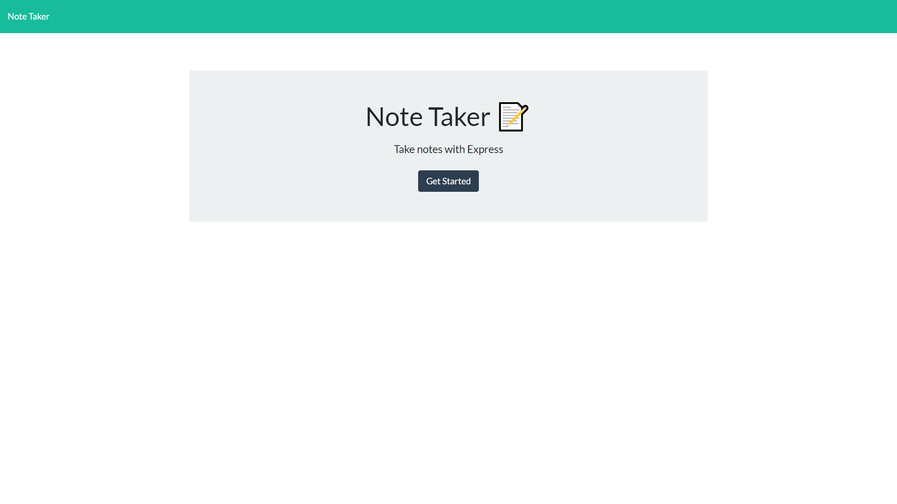

# Express Notes

## Description

Express notes is a basic note taking app that helps you save and retrieve your notes all in one place

## Table of Contents (Optional)

- [Installation](#installation)
- [Usage](#usage)
- [License](#license)

## Installation

Run node server.js in your terminal to get started

## Link
Click [here](https://express-notes-js.herokuapp.com/) to be taken to the application

## Usage

Javascript, ExpressJS, Node, HTML, Bootstrap

## License
[MIT](https://choosealicense.com/licenses/mit/)

